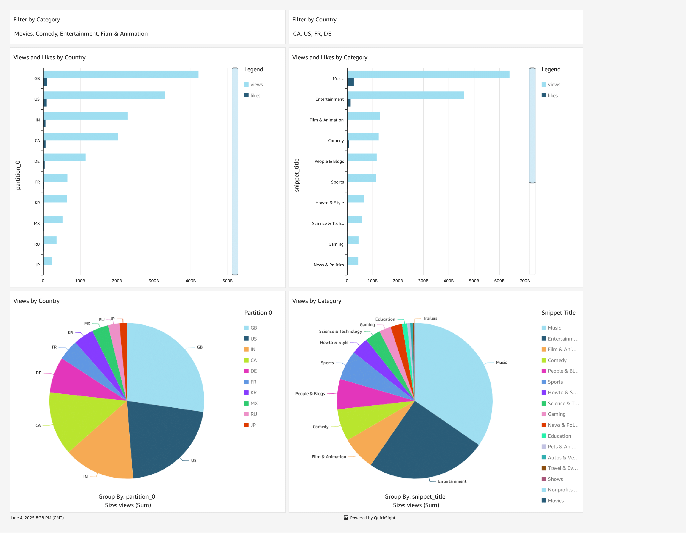

# YouTube Data Analysis

This is an end-to-end data engineering project that uses AWS cloud services to analyze YouTube trending video data across multiple regions.

## 📌 Overview

This project simulates a real-world advertising use case where a client wants to understand video trends before investing in YouTube campaigns. The goal is to extract, clean, catalog, and analyze YouTube data to uncover factors that influence video popularity.

## 🧰 Tech Stack

- **AWS S3** - raw and clean data storage  
- **AWS Lambda and AWS Glue** - ETL for JSON to Parquet conversion, Data Catalog and schema crawling
- **AWS Athena** - SQL-based querying of data
- **AWS QuickSight** - Visualize the trends analysis
- **Python, Pandas, AWS Wrangler** - data transformation
   
*Extras* - *IAM Roles, AWS Wrangler, AWS CLI*

## 📊 Sample Insights (from QuickSight)

-  Top trending and frequency by categories and country

-  Average video duration vs. view count
-  Weekly trends of video publishing

*Note: AWS QuickSight dashboards are not public, but visuals and screenshots are available upon request or in this repo.*

## 📁 Project Structure

- data/              # Sample data or S3 reference
- scripts/           # Lambda ETL, CLI commands
- sql/               # Athena queries
- aws_configs/       # IAM, Glue setup notes
- notebooks/         # EDA or analysis scripts
- dashboard/         # Screenshot or live link

## 📊 Business Objective

Analyze trends across YouTube video categories to:
- Understand what makes videos "trending"
- Guide ad spend targeting by region/category
- Generate real-time dashboards for decision makers
